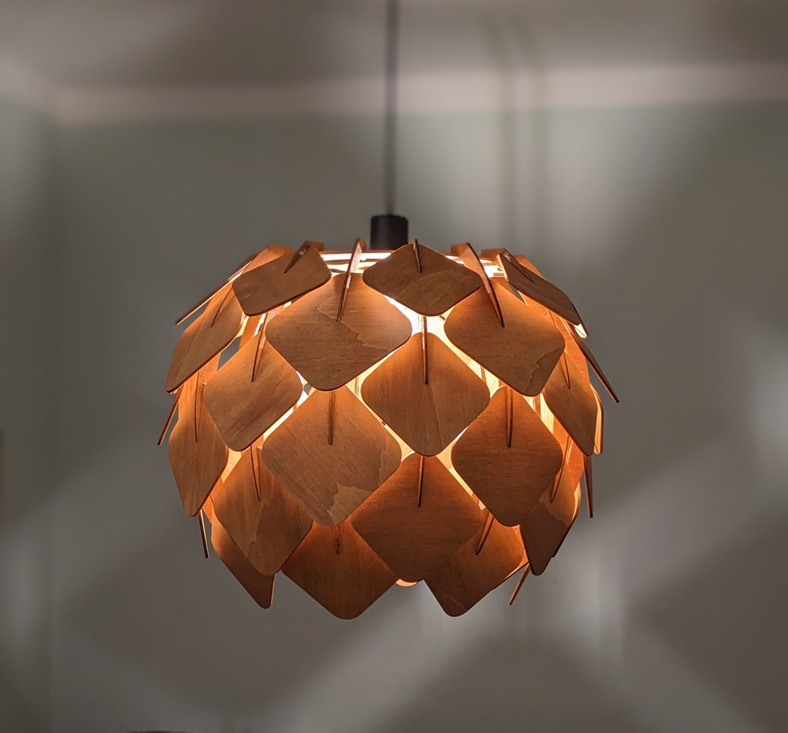
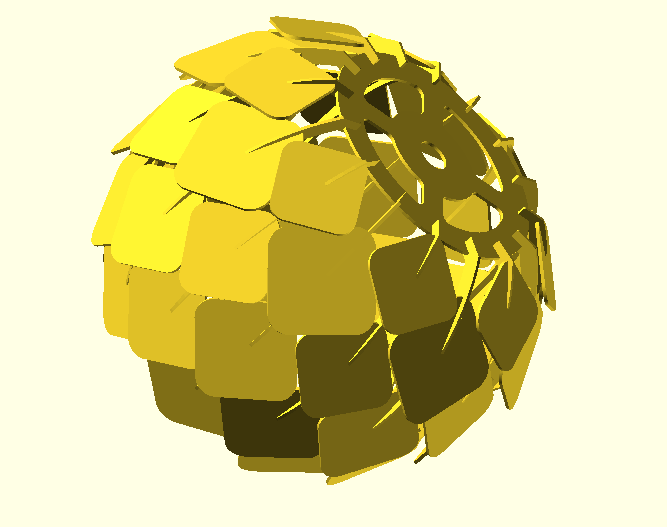
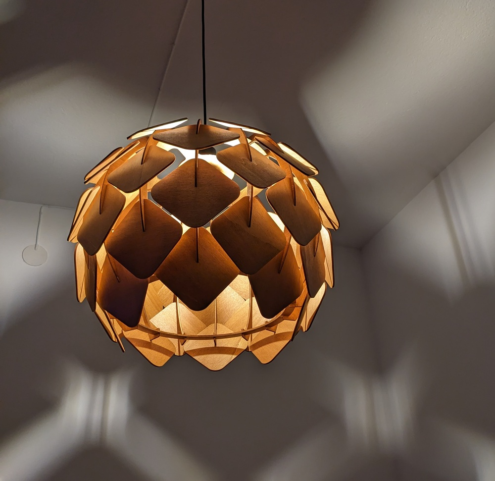

# Hop Lamp

This is the repository that contains the OpenSCAD files used to generate the
the parts of my Hop lamp (because I think it resembles a hop flower).



## Details

This lamp is made entirely of plywood (except for the electricity part).
The plywood is made out of poppler, 4mm thick, stained with a teak-colored
water-based wood stain.

## Building the lamp from this repo

You can download the generated .dxf files in the Release bundle, to be used with
with a laser cutter. The lamp requires no glue nor screws. The tightness of the
parts interlocking together might depend on the thickness of your plywood and
the amount of sanding you've done to the part. You can always add a bit of
painter's tape to make the fit tighter.

The files used to make the lamp are the following:

+ `top_plate.dxf`: the upper plate of the lamp, that has a hole for the
ligthbulb holder.
+ `bottom_plate.dxf`: the lower plater of the lamp, to add some rigidity
+ `2d_arm_0.dxf`:  One of the arms. 8 are required
+ `2d_arm_1.dxf`: The other arm. 8 are required.
+ `hop_petal_XY.dxf`: where `X` is the arm number, and `Y` the position of the
petal on the arm, top to bottom. (`01`, `02` and `03` for `2d_arm_0`, and `10`,
`11` and `12` for the `2d_arm_1`). For the whole lamp, you'll need 8 of each
petal.

## Generating the files from scratch

The project requires:

- [OpenSCAD](https://openscad.org/).
- [GNU Make](https://www.gnu.org/software/make/)

Genrate all the files with make:

``` shell
$ make release
```

## Modifying the original design

You can modify the lamp relatively easily. Just pay attention that the "petals"
are not colliding with each other.
The code could use some more modularity though, and some values are hard-coded.

## Gallery




## License

This work is licensed under [CC-BY-SA-NC 4.0](https://creativecommons.org/licenses/by-nc-sa/4.0/)
